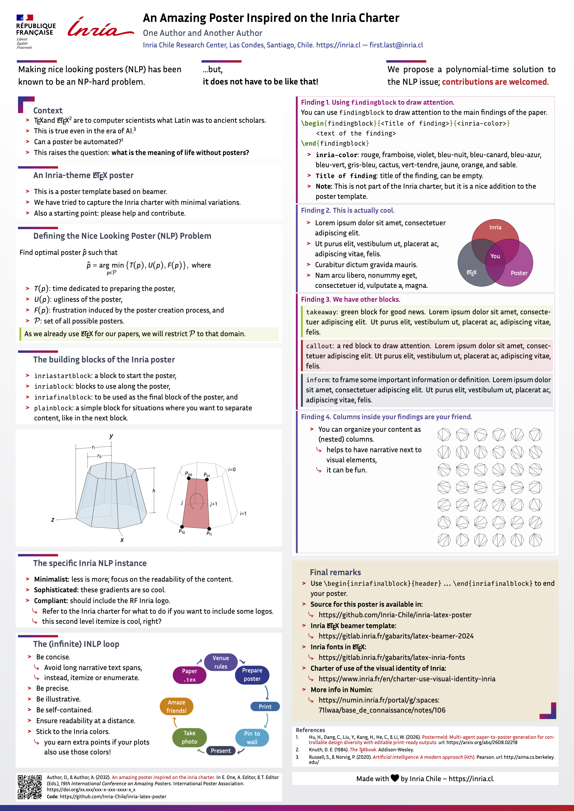

# Inria LaTeX poster template

A [beamer](https://ctan.org/pkg/beamer) + [beamerposter](https://ctan.org/pkg/beamerposter) template for scientific posters that follows the **Inria 2024 visual identity charter**, including the *République Française / Inria* block mark ("RF" logo) in the header and the Inria colour palette throughout. It is maintained by [Inria Chile](https://inria.cl).

The repository ships a complete, compilable example poster (`poster.tex`, DIN A0 portrait) whose content doubles as documentation of the blocks and boxes provided by the theme.

<p align="center">
  
</p>

## Features

- **Inria charter look and feel**: RF Inria block mark in the header, gradient footer band (bleu nuit → framboise → rouge), block decorations (corner glyph and gradient rule) drawn with TikZ so they scale to any paper size.
- **Inria 2024 colour palette** available as named colours (`inria-2024-rouge`, `inria-2024-bleu-nuit`, …).
- **Four block environments** (`inriastartblock`, `inriablock`, `inriafinalblock`, `plainblock`) built on `tcolorbox`.
- **Highlight boxes** for findings, take-aways, callouts and definitions.
- Inria Sans and Fira Code fonts, `minted` code listings, `biblatex` bibliography with HAL support, and a QR code pointing to your paper or code.
- Sample TikZ figures using the Inria colours in [sample-figs/](sample-figs/).

## Requirements

- A recent **TeX Live** (2025 or later) or equivalent distribution, compiled with **XeLaTeX** (the template uses `mathspec`/`fontspec`).
- **Fonts** installed system-wide so that `fontspec` can find them:
  - [Inria Sans](https://github.com/BlackFoundryCom/InriaFonts) (also distributed by Inria at <https://gitlab.inria.fr/gabarits/latex-inria-fonts>),
  - [Fira Code](https://github.com/tonsky/FiraCode) (used for monospace text and code listings).
- **biber** for the bibliography (`biblatex` with the `apa6` style).
- **Python 3** for `minted` v3 (`latexminted`). With TeX Live 2025+ it runs under restricted shell escape, so `-shell-escape` is not needed.
- LaTeX packages, all included in a full TeX Live: `beamerposter`, `tcolorbox`, `tikz`, `pgf`, `svg`, `MnSymbol`, `multiobjective`, `fontawesome7`, `qrcode`, `minted`, `biblatex`, `biblatex-apa6`, `smartdiagram`, `adjustbox`, `nicefrac`, `booktabs`, `csquotes`, `setspace`, `xspace`, `lipsum`.

## Building

```sh
latexmk -xelatex poster.tex
```

`latexmk` runs XeLaTeX, biber and XeLaTeX again as needed and produces `poster.pdf`. To remove the generated files:

```sh
latexmk -C poster.tex
```

### Overleaf

The project compiles on Overleaf: upload the repository (or import it from GitHub), open **Menu → Settings**, set the **Compiler** to *XeLaTeX* and the main document to `poster.tex`.

## Using the template

Start from `poster.tex` and replace the sample content.

### Title, authors and paper size

```latex
\usepackage[orientation=portrait,size=a0,scale=1.4]{beamerposter}
\usetheme{InriaPoster}

\title{Your poster title}
\author{First Author and Second Author}
\institute[]{Inria Chile Research Center, Santiago, Chile. \url{https://inria.cl}}
```

Change `orientation`, `size` (`a0`, `a1`, …) and `scale` in the `beamerposter` options to change the format. All decorations are defined relative to `\paperwidth`/`\paperheight`, so they adapt automatically.

### Blocks

The theme (`beamerthemeInriaPoster.sty`) defines four block environments. Each accepts an optional first argument with extra `tcolorbox` options and a mandatory title (which may be empty).

| Environment | Use |
| --- | --- |
| `inriastartblock` | First block of the poster. Corner glyph in the top-left. |
| `inriablock` | Regular blocks. Gradient rule above the title. |
| `inriafinalblock` | Closing block on a sand background. Corner glyph in the bottom-right. |
| `plainblock` | Undecorated white box, useful for figures, QR codes or grouping content. |

```latex
\begin{inriablock}{Context}
  \begin{itemize}
    \item ...
  \end{itemize}
\end{inriablock}
```

Use `\tcblower` inside a block to split it into an upper and a lower part. `columns` environments can be nested inside blocks to place text next to figures.

### Highlight boxes

The example document defines a few additional `tcolorbox` boxes on top of the theme. They are not part of the Inria charter, but they are handy for drawing attention to specific content:

| Box | Purpose |
| --- | --- |
| `\begin{findingblock}{<title>}{<colour>}` | Main findings of the paper. `<colour>` is an Inria colour name without the prefix (`rouge`, `framboise`, `violet`, `bleu-nuit`, `bleu-canard`, `bleu-azur`, `bleu-vert`, `gris-bleu`, `cactus`, `vert-tendre`, `jaune`, `orange`, `sable`). |
| `takeaway` | Green box for good news. |
| `callout` | Red box to draw attention. |
| `inform` | Grey-blue box for definitions or important information. |

### Colours

The Inria 2024 palette is defined in `beamercolorthemeinria.sty`:

| Name | Hex | | Name | Hex |
| --- | --- | --- | --- | --- |
| `inria-2024-rouge` | `#C9191E` | | `inria-2024-gris-bleu` | `#384257` |
| `inria-2024-framboise` | `#A60F79` | | `inria-2024-cactus` | `#608B37` |
| `inria-2024-violet` | `#5D4B9A` | | `inria-2024-vert-tendre` | `#95C11F` |
| `inria-2024-bleu-nuit` | `#27348B` | | `inria-2024-jaune` | `#FFCD1C` |
| `inria-2024-bleu-canard` | `#1067A3` | | `inria-2024-orange` | `#DD8300` |
| `inria-2024-bleu-azur` | `#00A5CC` | | `inria-2024-sable` | `#E2D0AA` |
| `inria-2024-bleu-vert` | `#88CCAA` | | `inria-rouge`, `inria-noir`, `inria-blanc` | aliases |

Use them in text (`\textcolor{inria-2024-framboise}{...}`) and, ideally, in your plots too.

### Bibliography and QR code

The reference to your own paper is kept in a `filecontents*` block at the top of `poster.tex`, which writes `self.bib` at compile time. Edit the entry there (title, authors, venue, DOI, HAL identifier) and it will be typeset with `\fullcite{author-year:keyword}` next to the QR code. Update the URL passed to `\qrcode` so that it points to your paper or code.

### Figures

Put your figures in a `figures/` directory (see `\graphicspath`) or input TikZ pictures as done with the samples in [sample-figs/](sample-figs/).

## Repository layout

```
.
├── poster.tex        Example poster and main document
├── beamerthemeInriaPoster.sty  Poster theme: header, footer, blocks, decorations
├── beamercolorthemeinria.sty   Inria 2024 colour palette
├── sample-figs/                TikZ sample figures used in the example
├── theme/                      Inria 2024 beamer theme (upstream) and artwork
│   ├── rf-inria.pdf            RF Inria block mark used in the header
│   └── imgs/                   Logos and original decoration artwork
└── preview.png                 Rendered preview of the example poster
```

The files in [theme/](theme/) come from the official Inria beamer template and are kept for reference and for the logo assets. The poster itself only loads `beamerthemeInriaPoster.sty` and `beamercolorthemeinria.sty` from the repository root.

## Poster tips

- Be concise: prefer itemised lists over long paragraphs.
- Be illustrative and self-contained, and check readability at a distance.
- Stick to the Inria colours, in figures as well as in text.
- Follow the [charter](https://www.inria.fr/en/charter-use-visual-identity-inria) if you need to add partner logos.

## References

- Inria beamer template (2024 charter): <https://gitlab.inria.fr/gabarits/latex-beamer-2024>
- Inria fonts for LaTeX: <https://gitlab.inria.fr/gabarits/latex-inria-fonts>
- Charter of use of the visual identity of Inria: <https://www.inria.fr/en/charter-use-visual-identity-inria>
- Internal notes on Numin: <https://numin.inria.fr/portal/g/:spaces:71lwaa/base_de_connaissance/notes/106>

## Contributing

This template is far from perfect. Issues and pull requests with fixes, new blocks or better examples are welcome.

## License and trademarks

The Inria logos, block mark and visual identity are the property of Inria and are governed by its [charter](https://www.inria.fr/en/charter-use-visual-identity-inria). No license has been chosen yet for the template code itself.

Made with ❤️ by [Inria Chile](https://inria.cl).
